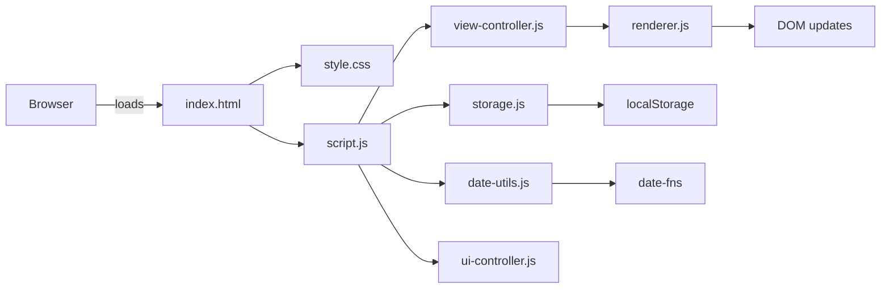
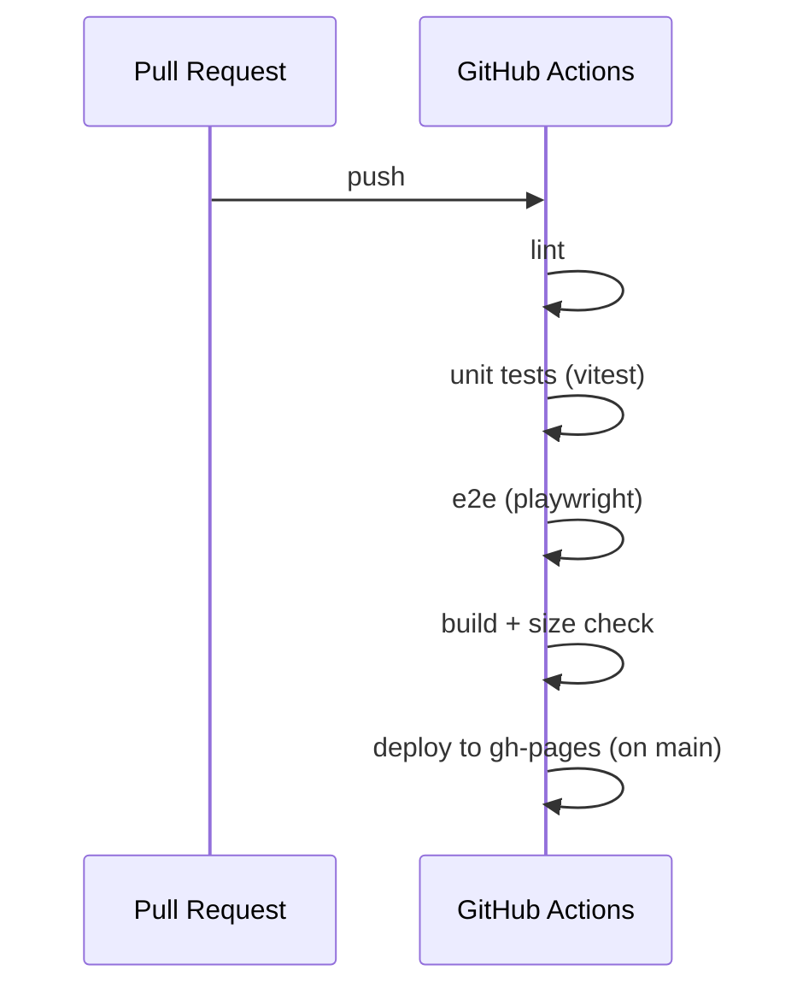

# Architecture — Simple Calendar App

## 概要
單頁應用（SPA），以模組化 Vanilla JS 為基礎。主要關注點：**date-utils**（核心邏輯）、**view renderer**（week/month）、**storage**（localStorage）、**ui controller**（切換、鍵盤、主題）、**PWA**（manifest + SW）、以及測試層（Vitest/Playwright）。

---

## 高階模組圖（Mermaid）

---

## 模組職責
- index.html
  - 載入 CSS 與 JS，提供語意化骨架（header, main, footer）。
- style.css
  - 使用 CSS Grid / Flex 來實現週視圖與月視圖排版，並提供暗黑/淺色主題切換樣式。
- script.js
  - 應為僅載入入口，並以 ES module import 子模組（utils, view-controller, storage, ui-controller）。
- date-utils.js
  - 所有日期運算（週起始 calc、區間檢查、format）皆在此處以 TDD 開發。
- view-controller.js
  - 管理當前視圖（week/month）、處理切換動作並通知 renderer。
- renderer.js
  - 負責實體 DOM 渲染（week grid / month grid）與事件呈現。
- storage.js
  - 封裝 localStorage 存取邏輯（state, events）。
- ui-controller.js
  - 處理鍵盤捷鍵、主題切換、無障礙焦點管理。
- service-worker.js / manifest.json
  - 基本 PWA 支援與資產快取策略。

---

## CI（Mermaid 流程圖）

---

## 部署
- 靜態網站部署到 GitHub Pages（gh-pages branch 或 action 配置）。
- Build 使用 Vite（或 esbuild）進行 minify 與 tree-shaking，並在 CI 中驗證 bundle size。

---

## 安全與可及性注意事項
- 儲存在 localStorage 的資料需經驗證/淨化（防止注入類型問題）。
- 提供鍵盤與 screen reader 支援：ARIA labels、專注管理、良好對比度。

---

## 擴展考量
- 未來可加入伺服器端同步 (REST / GraphQL) 或多用戶支援。
- 可考慮支援 i18n（多語系），但目前以繁體中文為首要目標。